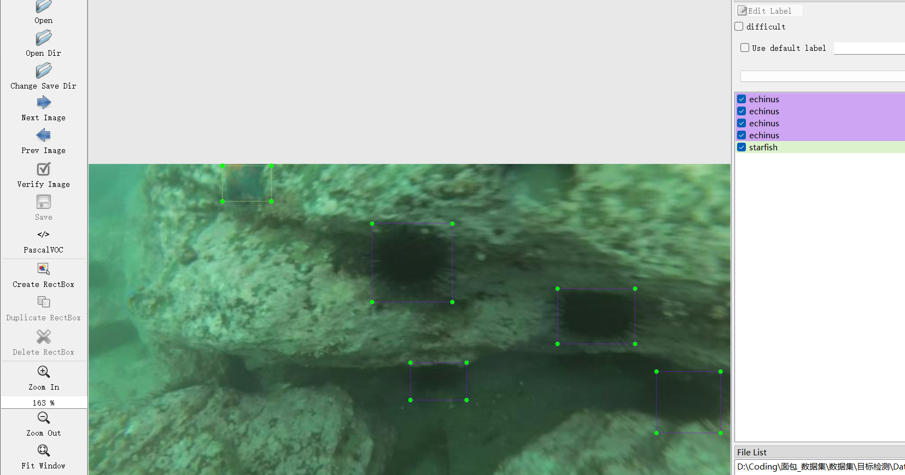

# Seabed Biodetection - Target Detection Dataset

Dataset Information Introduction: A total of 7383 images and corresponding annotation files are included. The annotation files come in two formats: VOC-formatted XML files and YOLO-formatted txt files.

Annotation Objects:
['Holothurian', 'Echinus', 'Starfish', 'Scallop']

Annotation Box Count Information: (The English labels are used for annotation, and the Chinese names provided in parentheses are for reference)
Holothurian: 6371 (Sea Cucumber)
Echinus: 28624 (Sea Urchin)
Starfish: 9264 (Sea Star)
Scallop: 13153 (Oyster)

Note: An image might contain multiple objects, so the total number of annotation boxes might be greater than the number of images.

The complete dataset consists of three folders and one txt file:
all_images: Stores the dataset's images. Screenshots are as follows:

Image Size Information:
all_txt: And classes.txt: Stores the yolo-formatted txt annotation files, in the same quantity as the images, with each annotation file corresponding to an image.
classes.txt:
For a detailed understanding of the standard yolo format, please search for it yourself on Baidu. In short, the number 0 represents the name at array index 0 in the classes.txt file.
all_xml: The VOC-formatted XML annotation file.
The quantity is the same as the images, with each annotation file corresponding to an image.
For a detailed understanding of the VOC format, please search for it yourself on Baidu.
Both formats of annotation can be used, choose one accordingly.
Annotation Screenshots:

## Images

Here is a pay link on Stripe ( https://buy.stripe.com/3cs8yP7sY87d0vu9AB ). Please contact me lonlonago@foxmail.com after funding $89, and I will send you a complete data files , thank you!

